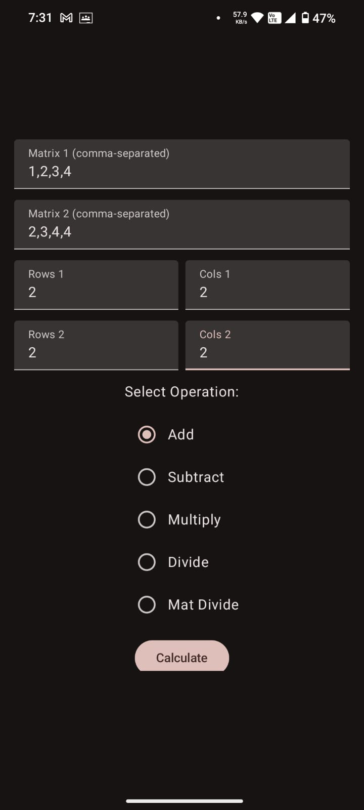
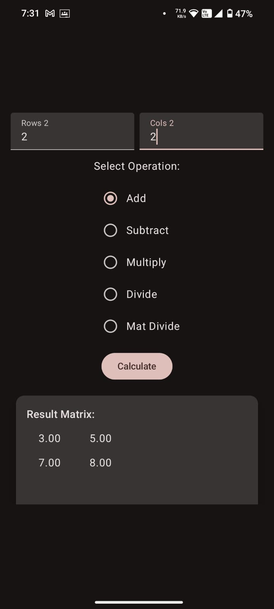

# MatOp - Matrix Operations Android App

**MatOp** is an Android application that allows users to perform various matrix operations such as addition, subtraction, multiplication, division, and matrix division (matrix multiplication with inverse).  
It uses **Jetpack Compose** for UI and calls **native C/C++ code via JNI** for efficient matrix computations.

---

## Features

- Enter two matrices manually.
- Choose the number of rows and columns for each matrix.
- Select an operation:
    - Add
    - Subtract
    - Multiply
    - Divide (element-wise)
    - Mat Divide (Matrix 1 × Inverse(Matrix 2))
- Display the result or error messages in case of invalid input.
- Smooth and responsive UI built with **Jetpack Compose**.
- Heavy computations are delegated to native C/C++ libraries for performance.

---

## Tech Stack

- **Kotlin** — Android development language
- **Jetpack Compose** — UI toolkit for building modern Android UIs
- **JNI (Java Native Interface)** — Connecting Kotlin with native C++ code
- **C/C++** — For fast matrix computations
- **Material 3** — UI styling and components

---

## Setup Instructions

### 1. Clone the Repository

git clone https://github.com/your-username/matop.git
cd matop

### 2. Open in Android Studio
- Launch Android Studio.
- Select File > Open and choose the project directory.

### 3. Install Required Tools
Ensure you have installed:
- NDK (Native Development Kit)
- CMake

You can install these through Android Studio > SDK Manager > SDK Tools.

### 4. Build the Project
- Let Gradle sync.
- If prompted, allow installation of missing components (e.g., CMake).

### 5. Run the App
- Connect a real device or use an emulator.
- Press the Run button.

## How to Use
- Enter comma-separated values into Matrix 1 and Matrix 2 input fields.
- Enter the number of rows and columns for each matrix.
- Select the desired operation using the radio buttons:(Add,Subtract,Multiply,Divide,Mat Divide)
- Click the Calculate button.
- View the result or an error message (if any dimension mismatch or invalid input occurs).

## Native Functions (JNI)

The following C/C++ functions are called from Kotlin:

| Function              | Description                                      |
|------------------------|--------------------------------------------------|
| `addMatrices`          | Element-wise addition of two matrices            |
| `subtractMatrices`     | Element-wise subtraction of two matrices         |
| `multiplyMatrices`     | Standard matrix multiplication                   |
| `divideMatrices`       | Element-wise division of two matrices            |
| `isMatrixInvertible`   | Checks if a matrix is invertible (non-singular)   |
| `invertMatrix`         | Computes the inverse of a square matrix          |

These functions are defined in the native library **`libmatop.so`** (loaded at runtime).

---

## Important Notes

- For **Addition**, **Subtraction**, and **Element-wise Division**, matrices must have the **same dimensions**.
- For **Multiplication**, the number of columns of **Matrix 1** must equal the number of rows of **Matrix 2**.
- **Mat Divide** first computes the inverse of **Matrix 2** and then multiplies it with **Matrix 1**. Matrix 2 must be a **square, invertible** matrix.
- Input validation ensures that invalid entries (non-numeric values, wrong dimensions) are caught and notified to the user.

---

## Screenshots
Example:

> 
> 

---

